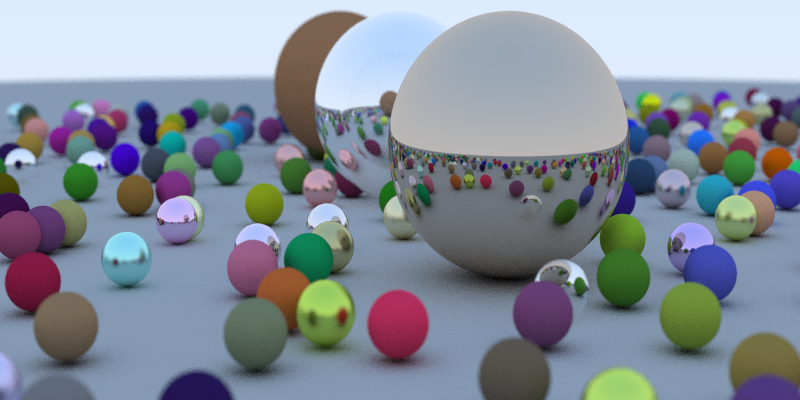

# SRay
SRay is a simple raytracing application based on Raytracer in one Weekend book.

It implements the following features:

* Sphere Geometric object
* Lambertian Material
* Dieletric Material
* Metal Material
* A movable Camera
    1. Focus adjustment 